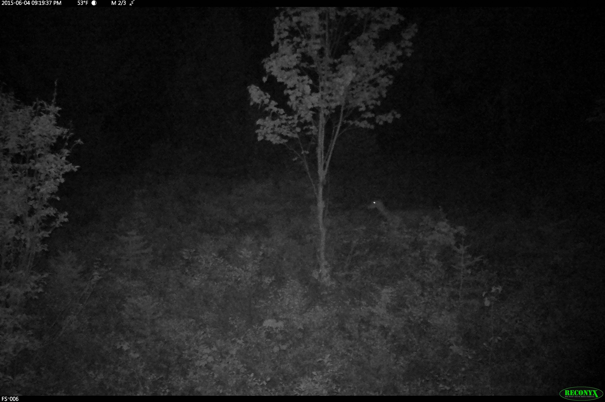
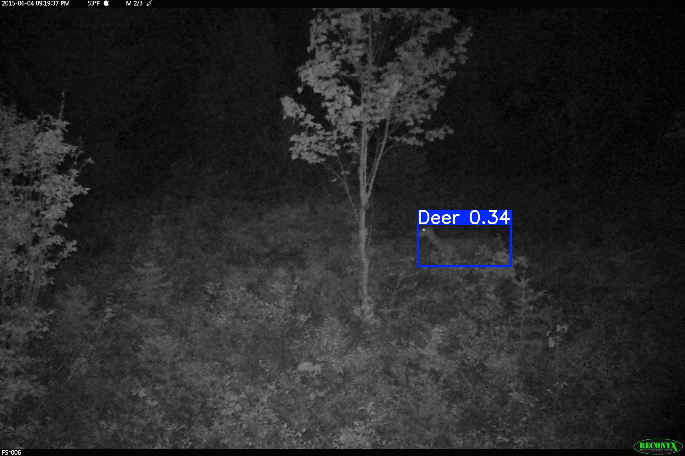

# 🚗 Low-Light Deer Detection using Image Enhancement

This project explores improving object detection performance in **low-light and nighttime conditions** using image preprocessing techniques with a **YOLOv8 baseline detector**.

The goal is to understand **when preprocessing helps, when it hurts, and why**, particularly in challenging infrared/nighttime wildlife scenes relevant to autonomous perception systems.

---

## 🔧 Project Focus

Low-light deer detection is difficult due to:

- extremely low visibility
- high noise levels
- poor object-background separation
- uneven infrared illumination
- cluttered natural environments

Rather than assuming one preprocessing method works universally, this project evaluates how different enhancement techniques impact detection under varying conditions.

---

## 🧪 Methods Evaluated

The following preprocessing techniques were tested:

- **Gamma Correction** – improves brightness in extremely dark scenes  
- **CLAHE (Contrast Limited Adaptive Histogram Equalization)** – enhances local contrast  
- **Gaussian Smoothing** – reduces noise before contrast enhancement  
- **Retinex-based Enhancement** – normalizes uneven illumination  

### Example Pipelines

- Gamma → YOLOv8  
- Gamma → Gaussian → CLAHE → YOLOv8  
- Retinex → YOLOv8  
- Retinex → CLAHE → YOLOv8  
- Gamma → Retinex → YOLOv8  

---

## 🖼️ Qualitative Results

### 🔹 Case A: Extreme Low-Light Recovery

Raw input:

Enhanced (Gamma + Gaussian + CLAHE):

👉 In extremely dark scenes, **gamma-based pipelines recovered usable signal**, enabling more reliable detection compared to CLAHE alone.

---

### 🔹 Case B: Retinex Failure Case

👉 In very low-signal, high-noise scenes, Retinex amplified noise and flattened structure, leading to poor detection performance.

---

### 🔹 Case C: Retinex Refinement Case

👉 In scenes with strong illumination imbalance (bright foreground, dark background), Retinex improved lighting consistency and slightly increased detection confidence.

---

## 📊 Key Findings

### 1. Gamma Correction is Most Effective for Very Dark Images
Gamma consistently improved detection when the scene had extremely low signal.

---

### 2. CLAHE Helps Only When Structure Exists
CLAHE enhances edges and contrast, but can amplify noise if the image lacks meaningful structure.

---

### 3. Gaussian + CLAHE is More Stable
Applying Gaussian smoothing before CLAHE reduces noise amplification and improves stability.

---

### 4. Retinex is Condition-Dependent
- Works well for **uneven lighting**
- Fails in **extremely noisy / low-signal environments**

---

### 5. Preprocessing is Not Universally Beneficial

> Enhancement only helps when there is **recoverable visual structure**

---

## 🧠 Core Insight

Instead of asking:

> “Which preprocessing method is best?”

This project shows:

> **Performance depends on the interaction between image conditions and preprocessing choice**

---

## 🧪 Experimental Setup

- Model: YOLOv8 (Ultralytics)
- Training: baseline + preprocessing variations
- Evaluation:
  - detection presence
  - bounding box accuracy
  - confidence scores
  - qualitative comparison across pipelines

---

## 🛠️ Files

- `Base_train.py` → YOLOv8 baseline training  
- `Clahe_train.py` → CLAHE-based training experiments  
- `test.py` → initial preprocessing comparisons  
- `test4.py` → extended pipeline including Retinex experiments  

---

## 🧠 Technical Stack

- Python  
- OpenCV  
- Ultralytics YOLOv8  
- Image Processing & Filtering  

---

## 🚀 Future Work

- Adaptive preprocessing based on brightness/noise estimation  
- Train separate models for low-light vs balanced lighting  
- Integrate preprocessing into training pipeline  
- Evaluate larger datasets with structured benchmarking  

---

## 📌 Summary

This project demonstrates that:

- **Gamma correction** is best for extremely dark scenes  
- **CLAHE + Gaussian** improves stability when structure exists  
- **Retinex** is useful for illumination imbalance, not noise-heavy scenes  

The key takeaway:

> Robust low-light detection requires **condition-aware preprocessing**, not a one-size-fits-all approach.

---

## 🔗 Repository

Full portfolio:  
https://github.com/anishram-beep/MS_AI_Portfolio
